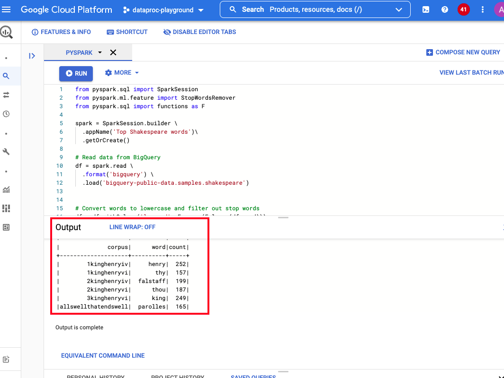
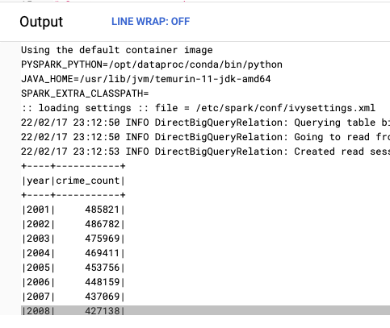
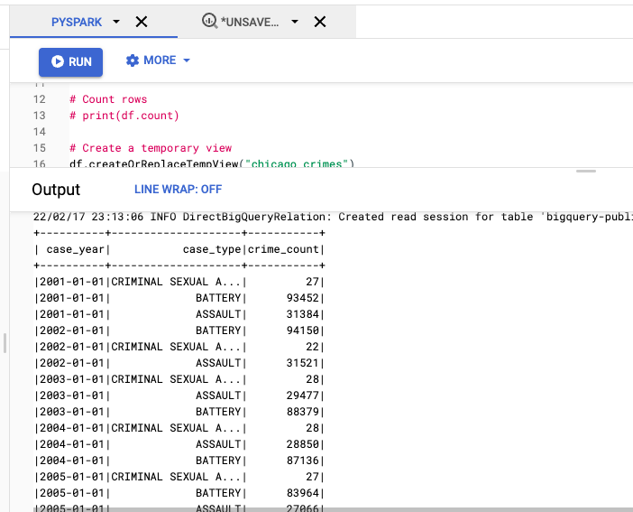
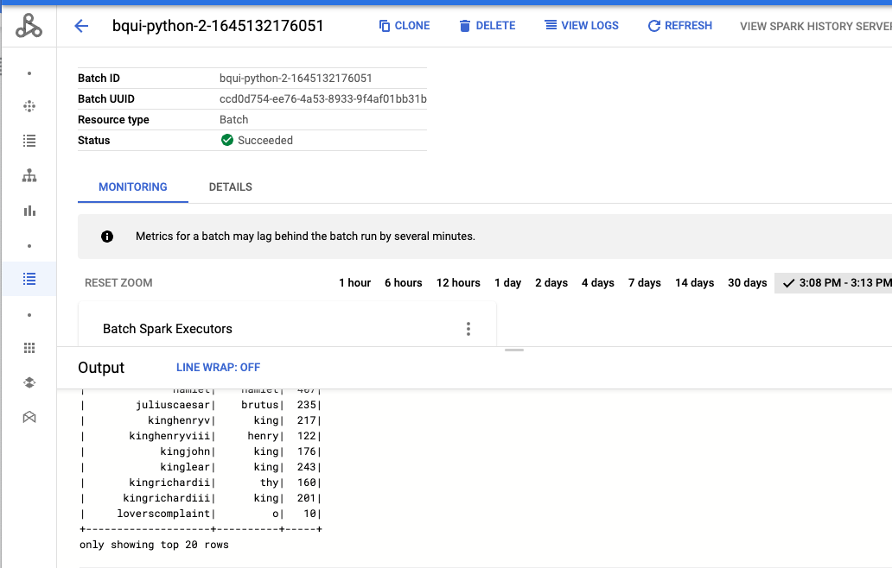
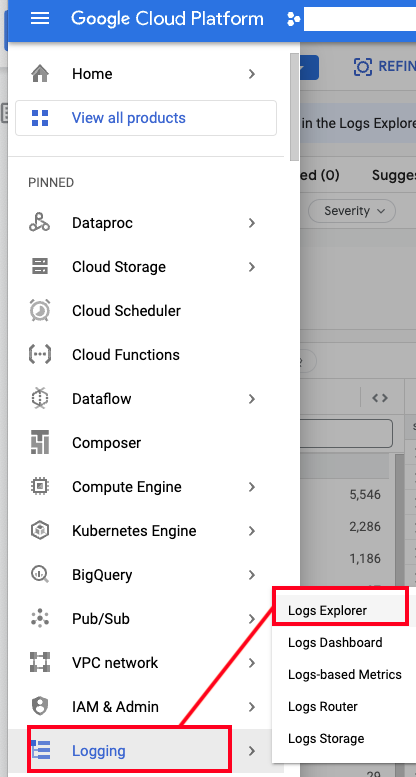
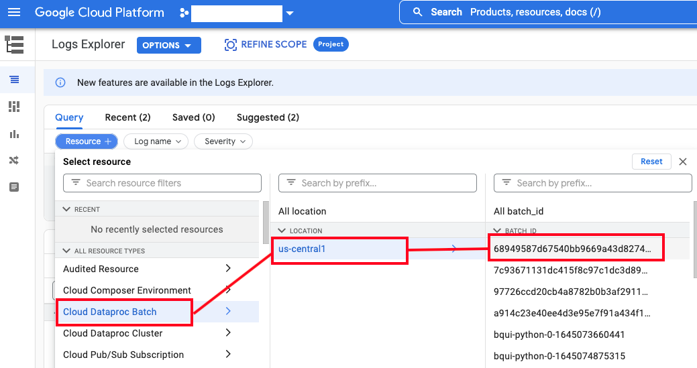
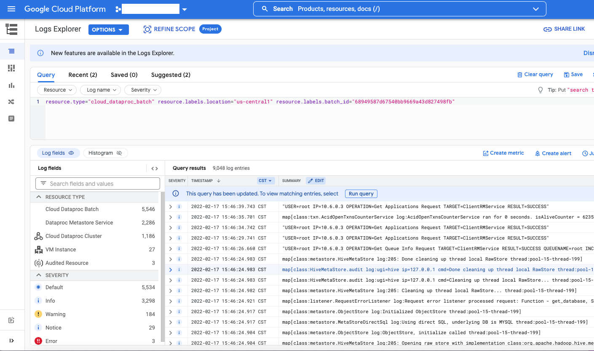

# About

This module covers fundamentals of running serverless Spark on GCP from the BigQuery UI through a practical and basic set of examples to get you quick-started. 

## 1. Pre-requisites

a) The Spark on BigQuery feature, currently needs enabling for Argolis. Submit a request [here](https://docs.google.com/forms/d/e/1FAIpQLSccIXlE5gJNE0dNs6vQvCfrCcSjnoHqaW2lxpoVkAh56KLOwA/viewform) with your Argolis user principal name - admin@\<your-org-name\> ... example admin@\<your-ldap\>.altostrat.com. <br>
  
b) Completion of the prior module
  <br>
  
<hr>
  
## 2. Dependency - storage bucket for code 

The code authored in the BigQuery UI gets packaged and persisted in this storage bucket.<br> 
Lets create a bucket.
<br>
  
In cloud shell on the cloud console, run the below-
```
#Replace as relevant to your environment

PROJECT_KEYWORD="vajra" 
SVC_PROJECT_NBR=481704770619                           
SVC_PROJECT_ID=dataproc-playground-335723 
BIGSPARK_CODE_BUCKET=gs://$PROJECT_KEYWORD-bigspark-$SVC_PROJECT_NBR-code
LOCATION=us-central1
  
gsutil mb -p $SVC_PROJECT_ID -c STANDARD -l $LOCATION -b on $BIGSPARK_CODE_BUCKET
```
<hr>
  

## 3. Navigate to the BigQuery UI for serverless PySpark

Follow the steps below to get to the BigQuery UI for serverless PySpark-
  
  
  
<br><br>
  
  
  
<br><br>
  
  
  
  
<br><br>
  
  
  
  
<br><br>
Select the storage bucket you created in step 2
  
  
  
<br><br>
  
 

<br><br>
Select the subnet you created in the foundational module and save
  
  
 
  
<br><br>
You should see a user interface as shown below-
  
  
 
   
<hr>

## 4. Lets run a word count sample

We are going to read data from a BigQuery public dataset and run a distributed computation (word count) on it in serverless Spark.
  
### 4.a. Our data
  
We are going to read data from the public dataset in BigQuery at ```bigquery-public-data.samples.shakespeare```. <br>
Here is a pictorial overview-
  
 
  
### 4.b. The PySpark code
  
This code reads the data in the table from 4.a, removes stopwords, and prints the top 20 corpuses with max word counts to the UI.
 
```
from pyspark.sql import SparkSession
from pyspark.ml.feature import StopWordsRemover
from pyspark.sql import functions as F

spark = SparkSession.builder \
  .appName('Top Shakespeare words')\
  .getOrCreate()

# Read data from BigQuery
df = spark.read \
  .format('bigquery') \
  .load('bigquery-public-data.samples.shakespeare')


# Convert words to lowercase and filter out stop words
df = df.withColumn('lowered', F.array(F.lower(df.word)))
remover = StopWordsRemover(inputCol='lowered', outputCol='filtered')
df = remover.transform(df)

# Create (count, word) struct and take the max of that in each corpus
df.select(df.corpus, F.struct(df.word_count, df.filtered.getItem(0).alias('word')).alias('count_word')) \
  .where(F.col('count_word').getItem('word').isNotNull()) \
  .groupby('corpus') \
  .agg({'count_word': 'max'}) \
  .orderBy('corpus') \
  .select(
     'corpus',
     F.col('max(count_word)').getItem('word').alias('word'),
     F.col('max(count_word)').getItem('word_count').alias('count')) \
  .show(20)

```
  
### 4.c. Paste the code and run
  
 

The results should something like this-
```
Using the default container image
PYSPARK_PYTHON=/opt/dataproc/conda/bin/python
JAVA_HOME=/usr/lib/jvm/temurin-11-jdk-amd64
SPARK_EXTRA_CLASSPATH=
:: loading settings :: file = /etc/spark/conf/ivysettings.xml
22/02/17 18:13:58 INFO DirectBigQueryRelation: Querying table bigquery-public-data.samples.shakespeare, parameters sent from Spark: requiredColumns=[corpus,word_count,word], filters=[]
22/02/17 18:13:58 INFO DirectBigQueryRelation: Going to read from bigquery-public-data.samples.shakespeare columns=[corpus, word_count, word], filter=''
22/02/17 18:14:01 INFO DirectBigQueryRelation: Created read session for table 'bigquery-public-data.samples.shakespeare': projects/.........

+--------------------+----------+-----+
|              corpus|      word|count|
+--------------------+----------+-----+
|        1kinghenryiv|     henry|  252|
|        1kinghenryvi|       thy|  157|
|        2kinghenryiv|  falstaff|  199|
|        2kinghenryvi|      thou|  187|
|        3kinghenryvi|      king|  249|
|allswellthatendswell|  parolles|  165|
|  antonyandcleopatra|    antony|  284|
|         asyoulikeit|  rosalind|  217|
|      comedyoferrors|  syracuse|  204|
|          coriolanus|coriolanus|  207|
|           cymbeline|    imogen|  137|
|              hamlet|    hamlet|  407|
|        juliuscaesar|    brutus|  235|
|          kinghenryv|      king|  217|
|       kinghenryviii|     henry|  122|
|            kingjohn|      king|  176|
|            kinglear|      king|  243|
|       kingrichardii|       thy|  160|
|      kingrichardiii|      king|  201|
|     loverscomplaint|         o|   10|
+--------------------+----------+-----+
only showing top 20 rows
```
  
 


## 5. Lets analyze Chicago crimes dataset with Spark SQL

### 5.a. Paste the code below that analyzes crimes by year & run
  
```
from pyspark.sql import SparkSession

spark = SparkSession.builder \
  .appName('Chicago Crimes Analysis')\
  .getOrCreate()

# Read data from BigQuery
baseDF = spark.read \
  .format('bigquery') \
  .load('bigquery-public-data.chicago_crime.crime')

# Create a temporary view
baseDF.createOrReplaceTempView("chicago_crimes")

# Crimes count by year
crimesByYearDF=spark.sql("SELECT year,count(*) AS crime_count FROM chicago_crimes GROUP BY year ORDER BY year;")
crimesByYearDF.show()

# Crimes count by year for specific crime types
crimesByYearAndTypeDF=spark.sql("SELECT cast(cast(year as string) as date) as case_year, primary_type as case_type, count(*) AS crime_count FROM chicago_crimes where primary_type in ('BATTERY','ASSAULT','CRIMINAL SEXUAL ASSAULT') GROUP BY case_year,primary_type ORDER BY case_year;")
crimesByYearAndTypeDF.show()
```

The resuts should be something like this-
```
+----+-----------+
|year|crime_count|
+----+-----------+
|2001|     485821|
|2002|     486782|
|2003|     475969|
|2004|     469411|
|2005|     453756|
|2006|     448159|
|2007|     437069|
|2008|     427138|
|2009|     392805|
|2010|     370455|
|2011|     351935|
|2012|     336222|
|2013|     307402|
|2014|     275674|
|2015|     264622|
|2016|     269666|
|2017|     268905|
|2018|     268539|
|2019|     260932|
|2020|     211558|
+----+-----------+
only showing top 20 rows

22/02/17 23:13:05 INFO DirectBigQueryRelation: Querying table bigquery-public-data.chicago_crime.crime, parameters sent from Spark: requiredColumns=[primary_type,year],.....


+----------+--------------------+-----------+
| case_year|           case_type|crime_count|
+----------+--------------------+-----------+
|2001-01-01|CRIMINAL SEXUAL A...|         27|
|2001-01-01|             BATTERY|      93452|
|2001-01-01|             ASSAULT|      31384|
|2002-01-01|             BATTERY|      94150|
|2002-01-01|CRIMINAL SEXUAL A...|         22|
|2002-01-01|             ASSAULT|      31521|
|2003-01-01|CRIMINAL SEXUAL A...|         28|
|2003-01-01|             ASSAULT|      29477|
|2003-01-01|             BATTERY|      88379|
|2004-01-01|CRIMINAL SEXUAL A...|         28|
|2004-01-01|             ASSAULT|      28850|
|2004-01-01|             BATTERY|      87136|
|2005-01-01|CRIMINAL SEXUAL A...|         27|
|2005-01-01|             BATTERY|      83964|
|2005-01-01|             ASSAULT|      27066|
|2006-01-01|             ASSAULT|      25945|
|2006-01-01|             BATTERY|      80666|
|2006-01-01|CRIMINAL SEXUAL A...|         38|
|2007-01-01|CRIMINAL SEXUAL A...|         45|
|2007-01-01|             ASSAULT|      26313|
+----------+--------------------+-----------+
only showing top 20 rows
```

Here is the output in the GUI-

 

<br><br>



<br><br>

### 5.b. Lets modify the above to write to a BQ table

Lets write this dataframe to a table-
```
# Crimes count by year
crimesByYearDF=spark.sql("SELECT year,count(*) AS crime_count FROM chicago_crimes GROUP BY year ORDER BY year;")
```

#### 5.b.1. Create a BQ dataset and table

Create a dataset-
```
bq --location=$LOCATION mk \
--dataset \
$SVC_PROJECT_ID:chicago_crimes_datamart
```


Create a table-
```
bq mk \
--table \
$SVC_PROJECT_ID:chicago_crimes_datamart.crimes_by_year \
crimes_year:INTEGER,crimes_count:NUMERIC
```


#### 5.b.2. Run the PySpark code below to persist the crimes count by year to BigQuery
Edit the reference to the table in the code below with your table with project and dataset prefix and run-

```
from pyspark.sql import SparkSession

spark = SparkSession.builder \
  .appName('Chicago Crimes Analysis')\
  .getOrCreate()

# Read data from BigQuery
baseDF = spark.read \
  .format('bigquery') \
  .load('bigquery-public-data.chicago_crime.crime')

# Create a temporary view
baseDF.createOrReplaceTempView("chicago_crimes")

# Crimes count by year
crimesByYearDF=spark.sql("SELECT year,count(*) AS crime_count FROM chicago_crimes GROUP BY year ORDER BY year;")
crimesByYearDF.show()

# Persist to BigQuery
crimesByYearDF.write.format("bigquery").option("table","chicago_crimes_datamart.crimes_by_year").save()
```

<br><br>

<hr>

## 6. How do you look at serverless jobs executed in Dataproc?

The listing can be found in the Dataproc -> Serverless -> Batches UI.<br>
By clicking on the specific job, the execution logs can be visualized.<br>
These logs are not permanently available, use Dataproc persistent Spark History Server to avoid losing logs after 24 hours.<br>


<br><br>


<br><br>



<br><br>

## 7. What if you want to list or kill a job?

Get a listing of jobs-
```
gcloud dataproc batches list --project $SVC_PROJECT_ID --region $LOCATION
```

Here are the author's list-
```
BATCH_ID: 7c93671131dc415f8c97c1dc3d899a29
JOB_TYPE: spark
STATUS: PENDING
```

To cancel the batch ID above, the command construct is as follows-
```
gcloud dataproc batches cancel 7c93671131dc415f8c97c1dc3d899a29 --project $SVC_PROJECT_ID --region $LOCATION
```

Sample result-
```
The batch [7c93671131dc415f8c97c1dc3d899a29] will be cancelled.
```

<hr>

## 8. How do you find the servereless spark logs in Cloud Logging?

Navigate to Cloud Logging on the cloud console, apply filters as shown below, to get to the logs-



<br><br>



<br><br>



<br><br>

## 9. How do you find the servereless spark logs in Cloud Logging?

Navigate to Cloud Logging on the cloud console, apply filters as shown below, to get to the logs-


<br><br>


<br><br>


<br><br>

<hr>

This concludes the module.

