# About

This module covers running **serverless batch jobs** with very basic examples. It covers how to use a persistent Spark History Server and also a common Dataproc Metastore Service.

Lets get started...

## Prerequisites

Completion of the [foundational setup module](foundational-setup.md).

## 1. Variables

Modify the varibles below as applicable for your environment and run the same in the cloud shell on the cloud console-

```
PROJECT_KEYWORD="vajra"  

ORG_ID=akhanolkar.altostrat.com                              
ORG_ID_NBR=236589261571
ADMINISTRATOR_UPN_FQN=admin@$ORG_ID 

SVC_PROJECT_NBR=481704770619                           
SVC_PROJECT_ID=dataproc-playground-335723   

#Your public IP address, to add to the firewall
OFFICE_CIDR=98.222.97.10/32
              
LOCATION=us-central1

SVC_PROJECT_UMSA="$PROJECT_KEYWORD-sa"
SVC_PROJECT_UMSA_FQN=$SVC_PROJECT_UMSA@$SVC_PROJECT_ID.iam.gserviceaccount.com


SPARK_SERVERLESS_NM=$PROJECT_KEYWORD-s8s
SPARK_SERVERLESS_BUCKET=gs://$SPARK_SERVERLESS_NM-$SVC_PROJECT_NBR


PERSISTENT_HISTORY_SERVER_NM=$PROJECT_KEYWORD-sphs
PERSISTENT_HISTORY_SERVER_BUCKET=gs://$PERSISTENT_HISTORY_SERVER_NM-$SVC_PROJECT_NBR

DATAPROC_METASTORE_SERVICE_NM=$PROJECT_KEYWORD-dpms

VPC_PROJ_ID=$SVC_PROJECT_ID        
VPC_PROJ_ID=$SVC_PROJECT_NBR  

VPC_NM=$PROJECT_KEYWORD-vpc
SPARK_SERVERLESS_SUBNET=$SPARK_SERVERLESS_NM-snet
SPARK_CATCH_ALL_SUBNET=$PROJECT_KEYWORD-misc-snet

PERSISTENT_HISTORY_SERVER_NM=$PROJECT_KEYWORD-sphs
```

<br><br>
<hr>

## 2. Run a simple batch job (SparkPi)

On cloud shell in the cloud console, run the following command to start a serverless batch job that calculates and prints the value of Pi. This is a great test for smoke-testing environment setup.

```
gcloud dataproc batches submit spark \
--project=$SVC_PROJECT_ID \
--region=$LOCATION \
--subnet projects/$SVC_PROJECT_ID/regions/$LOCATION/subnetworks/$SPARK_SERVERLESS_SUBNET \
--jars=file:///usr/lib/spark/examples/jars/spark-examples.jar \
--class org.apache.spark.examples.SparkPi -- 10000
```

You should see results in cloud shell similar to this-
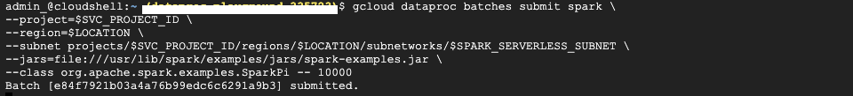  
  
<br><br>

Lets navigate in Cloud Console to the Dataproc service and go to "Serverless" and look at the logs-


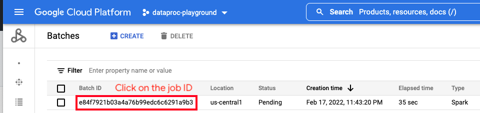  
  
<br><br>

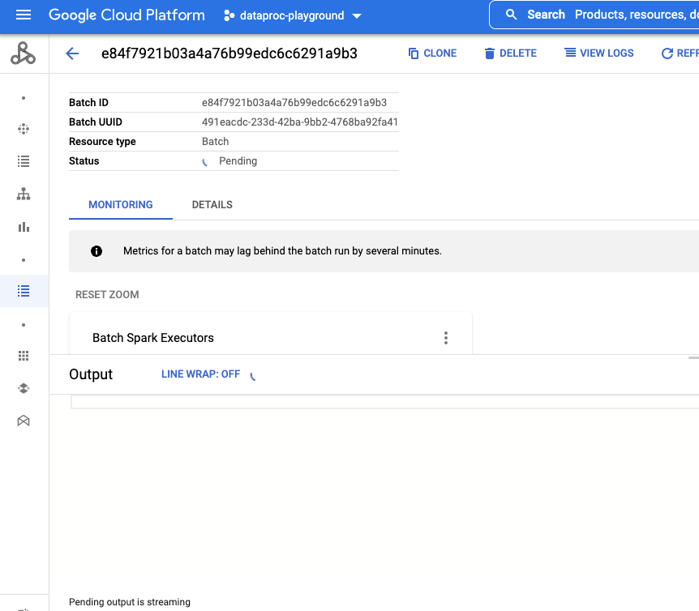  
  
<br><br>

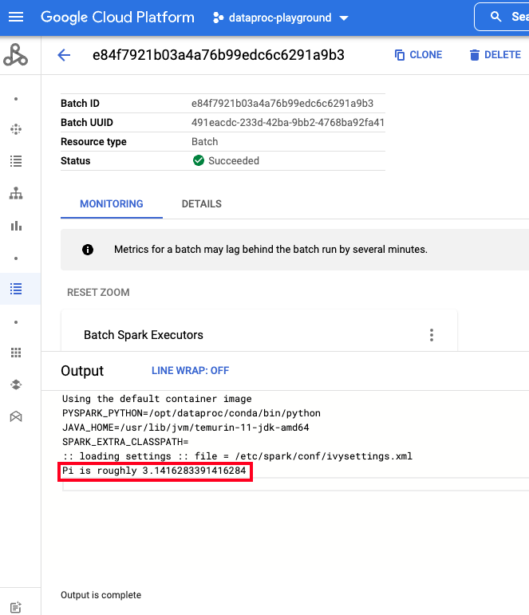  
  
<br><br>


<br><br>
<hr>

## 3. Run a simple batch job (SparkPi) with Persistent Spark History Server

Lets repeat the same job, this time with the persistent history server we created in the [foundational setup module](foundational-setup.md).<br>
All we need to do is add the following to the command-
```
--history-server-cluster=projects/$SVC_PROJECT_ID/regions/$LOCATION/clusters/$PERSISTENT_HISTORY_SERVER_NM
```
<br>

On cloud shell in the cloud console, run the following command that includes the persistent spark history server-
```
gcloud dataproc batches submit spark \
--project=$SVC_PROJECT_ID \
--region=$LOCATION \
--subnet projects/$SVC_PROJECT_ID/regions/$LOCATION/subnetworks/$SPARK_SERVERLESS_SUBNET \
--jars=file:///usr/lib/spark/examples/jars/spark-examples.jar \
--history-server-cluster=projects/$SVC_PROJECT_ID/regions/$LOCATION/clusters/$PERSISTENT_HISTORY_SERVER_NM \
--class org.apache.spark.examples.SparkPi -- 10000
```

Lets look at the logs-

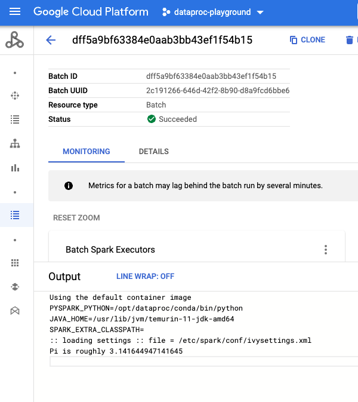  
  
<br><br>

Lets navigate on the cloud console to the Persistent Spark History Server

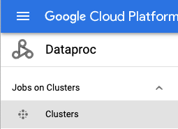 
 
<br><br>

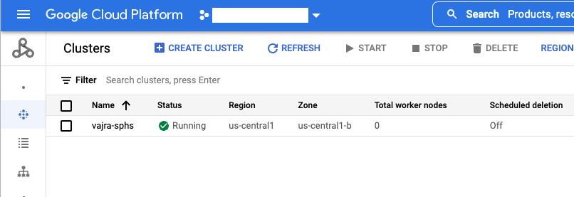 
 
<br><br>

 
 
<br><br>

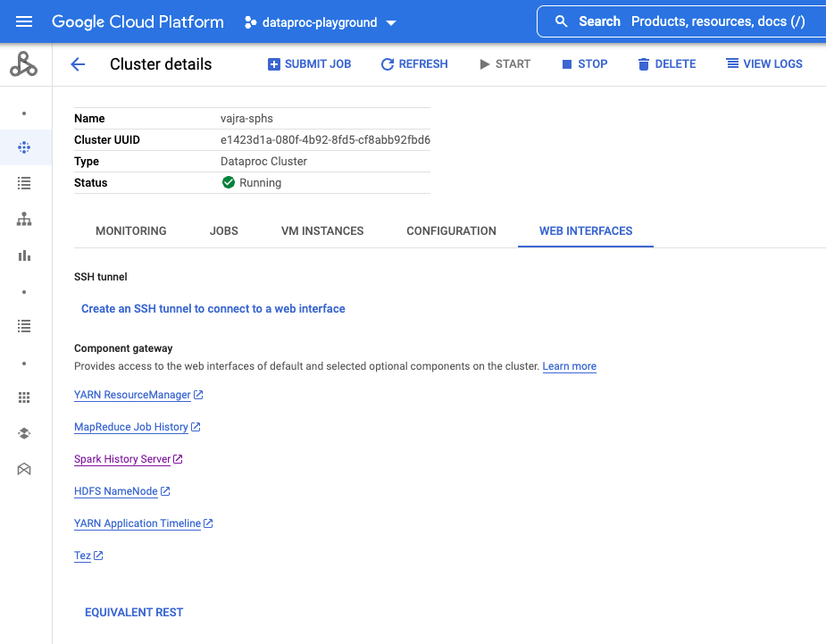 
 
<br><br>

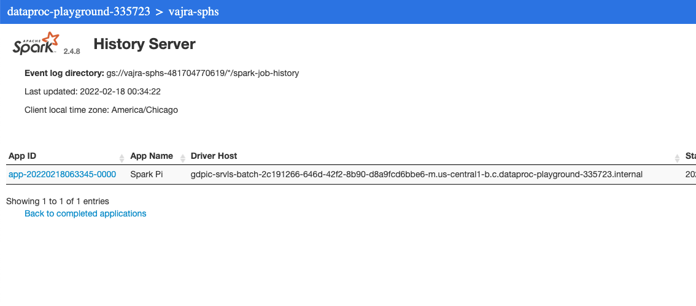 
 
<br><br>

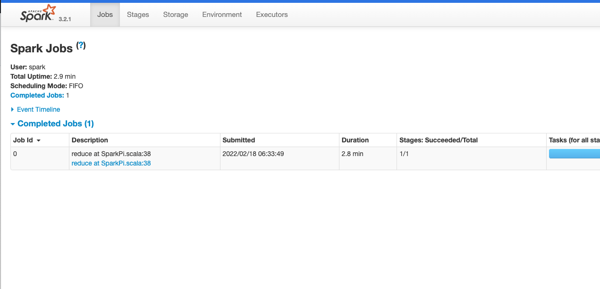 
 
<br><br>

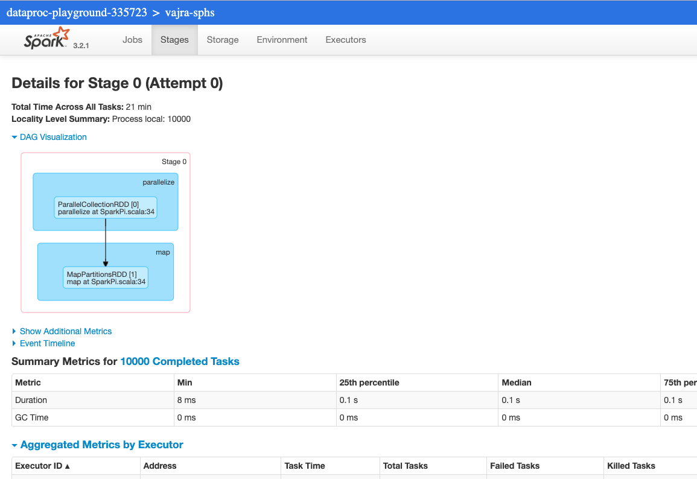 
 
<br><br>

 
 
<br><br>

<br><br>
<hr>

## 4. Run a batch job with structured data using Dataproc Metastore Service


<br><br>
<hr>

This concludes the module.
